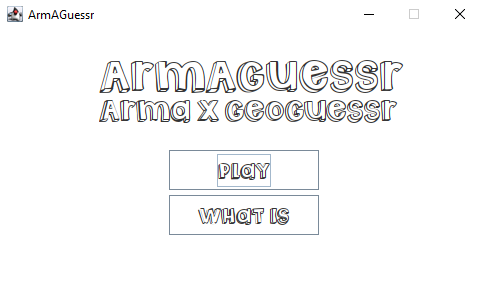
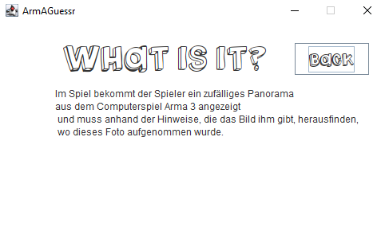
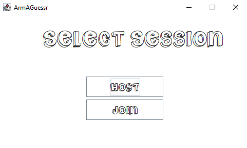
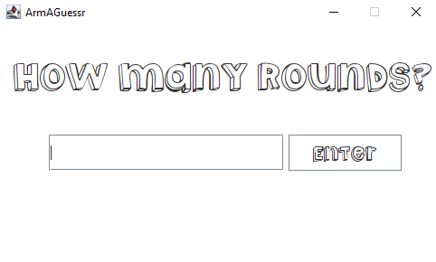
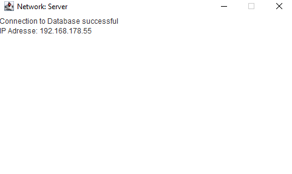
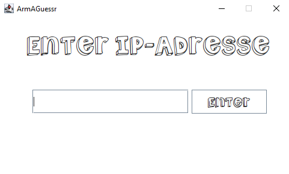
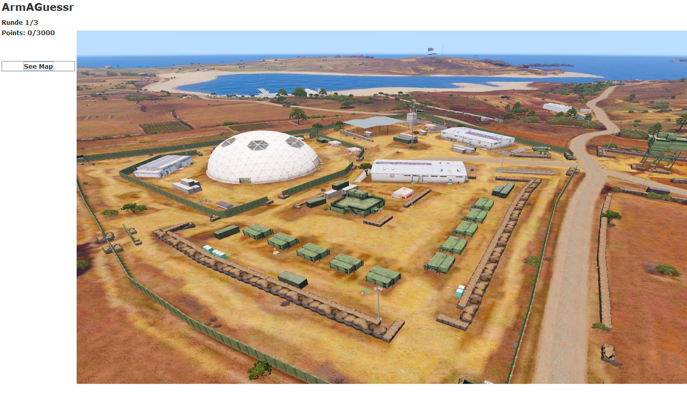
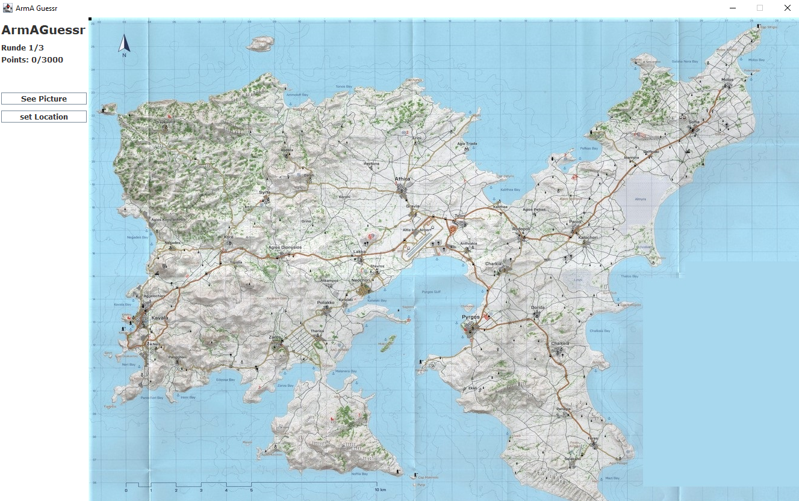
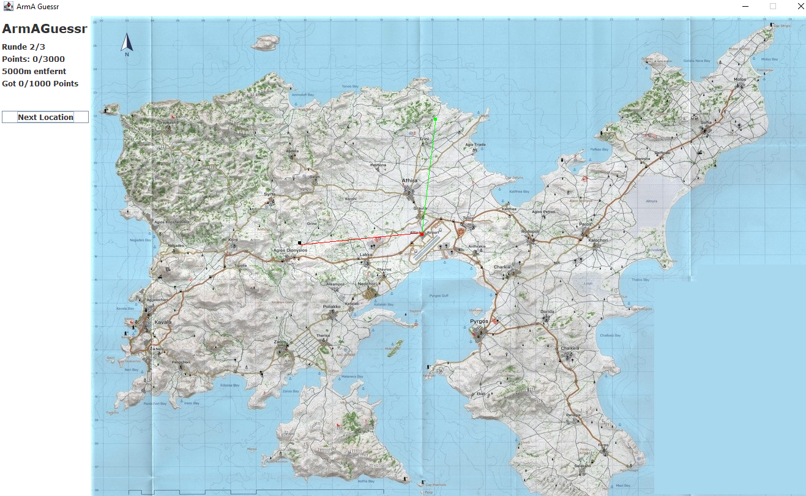
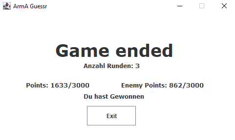

# Arma Guessr

#### Spiel funktioniert nur im localen Netzwerk

Im Spiel bekommt der Spieler ein zufälliges Bild aus
dem Computer Spiel Arma 3 angezeigt und muss anhand der Hinweise, die das Bild ihm gibt, 
herausfinden, wo dieses Foto aufgenommen wurde.

### Startbildschirm

Mit dem "Play" Button kommt man zur Auswahlmenü für Spieler und Host.
Durch Drücken des "What is" Buttons bekommt man eine kurze Erklärung was Geoguessr überhaupt ist. (Siehe Oben)

### What is Screen

Kurze ERklärung zu GeoGuessr.
Spieler kommt zurück in den Start Bildschirm durhc betätigen des "Back" Buttons.
Es kann beliebig oft zwischen dem "Startbildschirm" und dem "What is Screen" gewechselt werden.

### Select Session Screen

Host:
Spieler wird zum Server über den das Spiel läuft.
Join:
Spieler wird zum Client der sich zum Server verbindet

### Host Session Screen

Der Host wählt die Anzahl der Ruden aus die gespielt werden.
1 Runde = 1 Bild
Max Rundenanzahl beträgt Anzahl der Bilder. (Momentan 36)

### Network Screen

Nachdem der Host die Rundenanzahl bestätigt hat öffnet sich ein Fenster mit seiner IP-Adresse.
Diese muss der Client der auf auf den "Join" Button gedrückt hat eingeben.

### Join Screen

### See Picture Screen

Nachdem sich von Client zum Server verbunden wurde öffnet sich ein neuer Screen mit einem zufällig ausgewählten Bild.
Der Spieler muss sich nun die markanten Bildmerkmale einprägen und kann danach durch den "See Map" Button zur Map gelangen.

### See Map Screen

Hier kann der Spieler durch drücken der linken Maustaste eine Postion auswählen.
Zwischen Map und Bild kann beliebig oft gewechselt werden und auch die ausgewählte Position kann beliebig oft neu gewählt werden.
Der Spieler bestätigt seine Eingabe mit dem "set Location" Button. Nachdem dieser Knopf betätigt wurde kann die Position nicht mehr gewechselt 
und das Bild nicht mehr angeschaut werden.

Nun wird auf die Bestätigung des anderen Spielers gewartet.

### After Round Screen

Nachdem der andere Spieler bestätigt hat wird dem Spieler die Anzahl der Meter die Spieler vom Zielort entfernt war und die Anzahl der bekommenen Punkte angezeigt.
Der Schwarze Punkt symbolisiert hierbei die Spielerposition und der Rote Punkt die ZielPosition.
Die Rote Gerade zeigt den Weg zwischen Spieler Punkt und Endpunkt.
Der Grüne Punkt zeigt den vom Gegner gesezten Punkt und die Grüne gerade den Weg zwischen Gegner Punkt und Endpunkt.

Mit drückens des "Next Location" Buttons wird das nächste Bild im "See Picture Screen" angezeigt und eine neue Runde beginnt.
Das Spiel verläuft jede Runde gleich (Startet beim "See Picture Screen" und ended beim "After Round Screen").

### End Screen

Nachdem alle Runden gespielt wurden wird dem Spieler ein Endscreen angezeigt.
Hierbei sieht man die Anzahl der Gespielten Runden, die Anzahl der Eigenen und Gegnerischen Punkten.
Es wird auch angezeigt wer das Spiel gewonenn hat.

Mit dem Knopf "Exit" kann man die Anwendung im Anschluss beenden.

# All copywright reserved to @capri
